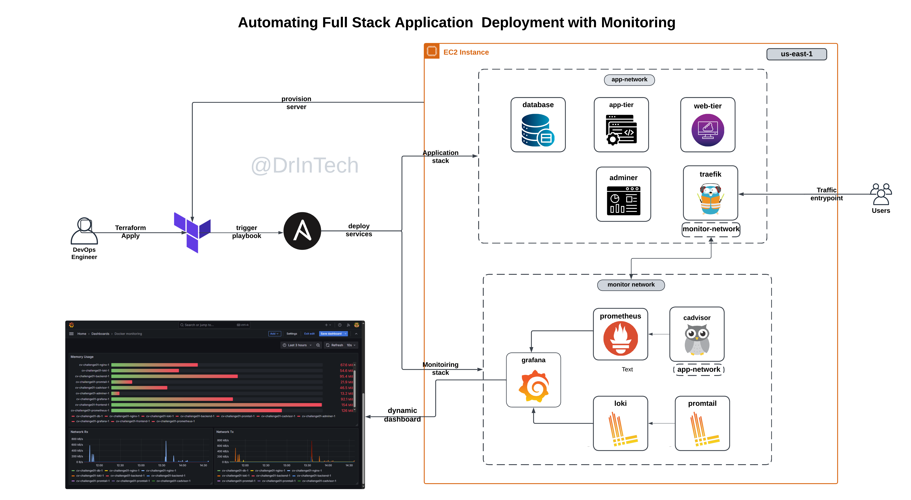

# Full Stack Automation Project Documentation

## Table of content

- [Overview](#overview)
- [Objectives](#objectives)
- [Project Architecture](#project-architecture)
- [Deployed Services](#deployed-services)
- [Technologies](#technologies)
- [Configurations](#configurations)
- [Project Setup](#project-setup)
---

## Overview

This project aims to automate the deployment of Full stack applications using **Terraform** for cloud infrastructure provisioning and **Ansible** for configuration management. The goal is to set up a fully automated workflow that provisions the necessary infrastructure, deploys the application and monitoring stacks, set up visualizations and grafana dashboards, and configures routing between services using Traefik.

---

## Objectives

- **Provision Infrastructure**: Use Terraform to provision Infrastructure (e.g., VM instance, networking).
- **Automate Application Deployment**: Utilize Ansible to configure the environment and deploy containerized services.
- **Set Up Monitoring**: Deploy Prometheus and Grafana to monitor application health and metrics with dynamic dashboards.
- **Automate Routing**: Configure routing between services with Traefik for seamless service communication.

---

## Project Architecture


## Project Structure
```
full-stack-automation/
├── ansible/
│   ├── roles/
│   ├── compose.monitoring.yml.j2
│   ├── compose.yml.j2
│   └── playbook.yml
├── backend/
│   ├── .env (should exist only on server or local machine)
│   └── .env.sample
├── frontend/
│   ├── .env (should exist only on server or local machine)
│   └── .env.sample
├── monitoring/
│   ├── dashboards/
│   ├── dashboard-providers.yml
│   ├── loki-config.yml
│   ├── loki-datasource.yml
│   ├── prometheus-datasource.yml
│   ├── prometheus.yml
│   └── promtail-config.yml
├── terraform/
│   ├── ansible.tf
│   ├── backend.tf
│   ├── ec2.tf
│   ├── dns.tf
│   ├── main.tf
│   ├── output.tf
│   ├── terraform.tfvars (should exist only on server or local machine)
│   ├── variables.tf
│   └── vpc.tf
├── .gitignore
└── POSTGRES_PASSWORD.txt (should exist only on server or local machine)
```

### Deployed Services
---
- **Application Stack**:  
  - **Frontend**: React Application (Dockerized)
  - **Backend**: FastAPI Service (Dockerized)
  - **Database**: PostgreSQL (Dockerized)
  - **Reverse Proxy**: Traefik or Nginx for routing
  
- **Monitoring Stack**:  
  - **Prometheus**: For metrics collection
  - **Grafana**: For data visualization and dashboard creation
  - **cAdvisor**: For container-level metrics
  - **Loki**: For log aggregation
  - **Promtail**: For log collection
  
---

## Technologies

- **Terraform**: Infrastructure as Code tool to provision cloud resources.
- **Ansible**: Configuration management tool used for provisioning and configuring servers.
- **Docker**: Containerization platform used to package the application and monitoring stacks.
- **Traefik**: Reverse proxy for routing traffic between containers.
- **Grafana**: Used to monitor and visualize container-level metrics and logs.  
- **Prometheus**: collection of metrics
- **cAdvisor**: exposes container-level metrics
- **Loki**: log aggregation
- **Promtail**: log collection

---

## Configurations

### Provisioning Infrastructure with Terraform
---
Terraform automates the provisioning of the infrastructure. It sets up VPC, ec2 server and triggers the ansible playbook.

#### Config Files:
- **main.tf**: Configures the region for aws provider.
    ```hcl
    provider "aws" {
    region = var.aws_region
    }
    ```
- **backend.tf**: This Terraform configuration sets up an S3 backend for state storage and specifies the required Terraform and AWS provider versions.
    ```hcl
    terraform {
    backend "s3" {
        bucket         = "ansible-terraform01"
        region         = "us-east-1"
        key            = "ansible-terraform01/terraform.tfstate"
        dynamodb_table = "ansible-terraform01-lock"
        encrypt        = true
    }
    required_version = ">=0.13.0"
    required_providers {
        aws = {
        version = ">= 2.7.0"
        source  = "hashicorp/aws"
        }
    }
    }
- **vpc.tf**: creates a basic AWS network infrastructure, including a VPC, subnet, internet gateway, route table, and security group.
    ```hcl
    resource "aws_vpc" "vpc" {
    cidr_block = "10.0.0.0/16"
    enable_dns_support   = true
    enable_dns_hostnames = true
    tags = {
        Name = var.vpc-name
    }
    }

    resource "aws_subnet" "public_subnet" {
    vpc_id                  = aws_vpc.vpc.id
    cidr_block              = "10.0.1.0/24"
    map_public_ip_on_launch = true
    tags = {
        Name = var.subnet-name
    }
    }

    resource "aws_internet_gateway" "igw" {
    vpc_id = aws_vpc.vpc.id
    tags = {
        Name = var.igw-name
    }
    }

    resource "aws_route_table" "rt" {
    vpc_id = aws_vpc.vpc.id

    route {
        cidr_block = "0.0.0.0/0"
        gateway_id = aws_internet_gateway.igw.id
    }

    tags = {
        Name = var.rt-name
    }
    }

    resource "aws_route_table_association" "rt_association" {
    subnet_id      = aws_subnet.public_subnet.id
    route_table_id = aws_route_table.rt.id
    }

    resource "aws_security_group" "sg" {
    vpc_id = aws_vpc.vpc.id

    ingress = [
        for port in [22, 8080, 5173, 8000, 80, 443] : {
        description      = "TLS from VPC"
        from_port        = port
        to_port          = port
        protocol         = "tcp"
        ipv6_cidr_blocks = ["::/0"]
        self             = false
        prefix_list_ids  = []
        security_groups  = []
        cidr_blocks      = ["0.0.0.0/0"]
        }
    ]
    egress {
        from_port   = 0
        to_port     = 0
        protocol    = "-1"
        cidr_blocks = ["0.0.0.0/0"]
    }

    tags = {
        Name = var.sg-name
    }
    }
    ```
- **ec2.tf**: provisions an ec2 instance in the public subnet.
    ```hcl
    resource "aws_instance" "ec2" {
    ami           = var.ami_id
    instance_type = var.instance_type
    key_name      = var.key_pair_name
    subnet_id     = aws_subnet.public_subnet.id
    vpc_security_group_ids = [aws_security_group.sg.id]
    tags = {
        Name = var.ec2_name
    }

    provisioner "local-exec" {
        command = "echo 'Instance provisioned: ${self.public_ip}'"
    }
    }
    ```
- **ansible.tf**: automatically generates a dynamic Ansible inventory file, triggrs the Ansible playbook after the DNS records have been created by terraform.
    ```hcl
    # Create Ansible inventory file
    resource "local_file" "ansible_inventory" {
      filename = "../ansible/inventory.ini"
      content  = <<EOF
    [web_servers]
    ${aws_instance.ec2.public_ip} ansible_user=ubuntu ansible_ssh_private_key_file=${var.private_key_path}
    EOF
    }

    # Run the Ansible playbook
    resource "null_resource" "run_ansible" {
      depends_on = [
        aws_route53_record.frontend_record,
        aws_route53_record.www_frontend_record,
        aws_route53_record.db_record,
        aws_route53_record.www_db_record,
        aws_route53_record.traefik_record,
        aws_route53_record.www_traefik_record,
        local_file.ansible_inventory
      ]
      provisioner "local-exec" {
        command = "ANSIBLE_HOST_KEY_CHECKING=False ansible-playbook -i ../ansible/inventory.ini ../ansible/playbook.yml --extra-vars 'frontend_domain=${var.frontend_domain} db_domain=${var.db_domain} traefik_domain=${var.traefik_domain} cert_email=${var.cert_email}'"
      }
    }
  ```

- **dns.tf** : sets up the dns records for the domains.
  ```hcl
  # Fetch the existing hosted zone
  data "aws_route53_zone" "domain_zone" {
    name         = var.domain_name
    private_zone = false
  }

  # Create DNS records for main and www subdomains
  resource "aws_route53_record" "frontend_record" {
    zone_id = data.aws_route53_zone.domain_zone.zone_id
    name    = var.frontend_domain
    type    = "A"
    ttl     = 300
    records = [aws_instance.ec2.public_ip]
  }

  resource "aws_route53_record" "www_frontend_record" {
    zone_id = data.aws_route53_zone.domain_zone.zone_id
    name    = "www.${var.frontend_domain}"
    type    = "A"
    ttl     = 300
    records = [aws_instance.ec2.public_ip]
  }

  resource "aws_route53_record" "db_record" {
    zone_id = data.aws_route53_zone.domain_zone.zone_id
    name    = var.db_domain
    type    = "A"
    ttl     = 300
    records = [aws_instance.ec2.public_ip]
  }

  resource "aws_route53_record" "www_db_record" {
    zone_id = data.aws_route53_zone.domain_zone.zone_id
    name    = "www.${var.db_domain}"
    type    = "A"
    ttl     = 300
    records = [aws_instance.ec2.public_ip]
  }

  resource "aws_route53_record" "traefik_record" {
    zone_id = data.aws_route53_zone.domain_zone.zone_id
    name    = var.traefik_domain
    type    = "A"
    ttl     = 300
    records = [aws_instance.ec2.public_ip]
  }

  resource "aws_route53_record" "www_traefik_record" {
    zone_id = data.aws_route53_zone.domain_zone.zone_id
    name    = "www.${var.traefik_domain}"
    type    = "A"
    ttl     = 300
    records = [aws_instance.ec2.public_ip]
  }
  ```

- **outputs.tf**: outputs the public ip of the ec2 instance to be used for DNS propagation and access to the server.
    ```hcl
    output "instance_public_ip" {
    description = "Public IP of the EC2 instance"
    value       = aws_instance.ec2.public_ip
    }
    ```
- **variables.tf**: defines the structure of variables used in the Terraform configurations.
    ```hcl
    variable "aws_region" {
    description = "AWS region to deploy resources"
    default     = "us-east-1"
    }

    variable "vpc-name" {
    description = "Name of the VPC"
    default     = "MainVPC"
    }

    variable "subnet-name" {
    description = "Name of the Subnet"
    default     = "MainSubnet"
    }

    variable "igw-name" {
    description = "Name of the Internet Gateway"
    default     = "MainIGW"
    }

    variable "rt-name" {
    description = "Name of the Route Table"
    default     = "MainRouteTable"
    }

    variable "sg-name" {
    description = "Name of the Security Group"
    default     = "MainSG"
    }

    variable "ami_id" {
    description = "AMI ID for the EC2 instance"
    type        = string
    }

    variable "instance_type" {
    description = "EC2 instance type"
    default     = "t2.micro"
    }

    variable "key_pair_name" {
    description = "Key pair name for SSH access"
    type        = string
    }

    variable "private_key_path" {
    description = "private key path for ansible ssh access"
    type        = string
    }

    variable "ec2_name" {
    description = "Name of the EC2 instance"
    default     = "MainEC2Instance"
    }

    variable "frontend_domain" {
    description = "Domain name for the frontend"
    type        = string
    }

    variable "db_domain" {
    description = "Domain name for the database admin (Adminer)"
    type        = string
    }

    variable "traefik_domain" {
    description = "Domain name for traefik Proxy Manager"
    type        = string
    }

    variable "cert_email" {
    description = "Email for the let's encrypt certificate"
    type        = string
    }
    ```
- **terraform.tfvars**: defines the values for the variables used in the Terraform configurations.
  ```
  aws_region     = "us-east-1"
  ami_id         = "ami-005fc0f236362e99f" # Replace with a valid AMI ID
  instance_type  = "t3.medium"
  key_pair_name  = "hello"
  private_key_path = "../../hello.pem" # relative path to terraform folder

  frontend_domain = "cv1.drintech.online"
  db_domain       = "db.cv1.drintech.online"
  traefik_domain  = "traefik.cv1.drintech.online"
  cert_email      = "admin@example.com" # replace with a valid email
  ```
---
### Configuration Management with Ansible
Ansible installs the necessary software on the server, copy the necessary files and automatically the deploy the application and monitoring stack.
The tasks are logically group into roles to promote modularity and maintainability. Below is the structure of the ansible folder.

- **playbook.yml**: This is the main playbook that executes all tasks defined in the roles.
  ```yaml
  ---
  - name: Setup Docker and Run Compose
    hosts: all
    become: true
    roles:
      - docker_setup
      - file_structure
      - copy_files
      - loki_driver
      - docker_compose
  ```
- **roles**: contains the Ansible roles for each step of the deployment.
  - **docker_setup**: installs Docker and related plugins.
    ```
    ---
    - name: Install prerequisites for Docker
      apt:
        name:
          - apt-transport-https
          - ca-certificates
          - curl
          - software-properties-common
        state: present

    - name: Add Docker GPG key
      shell: |
        curl -fsSL https://download.docker.com/linux/ubuntu/gpg | gpg --dearmor -o /usr/share/keyrings/docker-archive-keyring.gpg
      args:
        creates: /usr/share/keyrings/docker-archive-keyring.gpg

    - name: Add Docker repository
      shell: |
        echo "deb [arch=$(dpkg --print-architecture) signed-by=/usr/share/keyrings/docker-archive-keyring.gpg] https://download.docker.com/linux/ubuntu $(lsb_release -cs) stable" > /etc/apt/sources.list.d/docker.list

    - name: Install Docker and related plugins
      apt:
        name:
          - docker-ce
          - docker-ce-cli
          - containerd.io
          - docker-buildx-plugin
          - docker-compose-plugin
        state: present
        update_cache: yes

    - name: Ensure Docker service is running
      service:
        name: docker
        state: started
        enabled: true

    - name: Create app-network 
      community.docker.docker_network:
        name: app-network
        driver: bridge
      become: true

    - name: Create monitor-network
      community.docker.docker_network:
        name: monitor-network
        driver: bridge
      become: true
    ```
  - **file_structure**: creates the required folders and files.
    ```
    ---
    - name: Create required directories
      file:
        path: "{{ item }}"
        state: directory
        mode: '0755'
      loop:
        - /home/ubuntu/monitoring
        - /home/ubuntu/frontend
        - /home/ubuntu/backend
        - /home/ubuntu/traefik

    - name: Ensure acme.json file exists
      file:
        path: /home/ubuntu/traefik/acme.json
        state: touch
        owner: ubuntu
        group: ubuntu
        mode: '0600'
    ```
  - **copy_files**: copies the necessary files to the server.
    ```
    ---
    - name: Copy the main Docker Compose file
      template:
        src: compose.yml.j2
        dest: /home/ubuntu/compose.yml
        force: yes

    - name: Copy the monitoring Docker Compose file
      template:
        src: compose.monitoring.yml.j2
        dest: /home/ubuntu/compose.monitoring.yml
        force: yes

    - name: Copy frontend environment file
      template:
        src: ../frontend/.env
        dest: /home/ubuntu/frontend/.env

    - name: Copy backend environment file
      copy:
        src: ../backend/.env
        dest: /home/ubuntu/backend/.env

    - name: Copy monitoring configurations
      copy:
        src: ../monitoring/
        dest: /home/ubuntu/monitoring/
        force: yes

    - name: Copy postgres password file
      copy:
        src: ../POSTGRES_PASSWORD.txt
        dest: /home/ubuntu/POSTGRES_PASSWORD.txt
        mode: '0600'
        owner: ubuntu
        group: ubuntu
        force: yes
    ```
  - **loki_driver**: installs the Loki Docker driver plugin.
    ```
    ---
    - name: Install the Loki Docker driver plugin
      shell: |
        if ! docker plugin ls | grep -q "loki"; then
          docker plugin install grafana/loki-docker-driver:2.9.1 --alias loki --grant-all-permissions
        fi

    - name: Create /etc/docker/daemon.json with Loki configuration
      copy:
        dest: /etc/docker/daemon.json
        content: |
          {
            "log-driver": "loki",
            "log-opts": {
              "loki-url": "http://localhost:3100/loki/api/v1/push",
              "loki-batch-size": "400"
            }
          }
        force: yes

    - name: Restart Docker service
      shell: systemctl restart docker
    ```
  - **docker_compose**: deploys the application and monitoring stacks.
    ```
    ---
    - name: Run main Docker Compose
      shell: docker compose up -d
      args:
        chdir: /home/ubuntu
    ```
- **compose.monitoring.yml.j2**: contains the templated configuration for the Docker Compose monitoring stack.
```yaml
services:
  prometheus:
    image: prom/prometheus
    expose:
      - "9090"
    command:
      - '--config.file=/etc/prometheus/prometheus.yml'
      - '--web.external-url=/prometheus'
    volumes:
      - ./monitoring/prometheus.yml:/etc/prometheus/prometheus.yml
    networks:
      - monitor-network
    depends_on:
      - cadvisor
    labels:
      - traefik.enable=true
      # HTTP Service
      - traefik.http.services.prometheus.loadbalancer.server.port=9090 # important
      # HTTP Router
      - traefik.http.routers.prometheus-http.rule=((Host(`{{ frontend_domain }}`) || Host(`www.{{ frontend_domain }}`)) && PathPrefix(`/prometheus`))
      - traefik.http.routers.prometheus-http.entrypoints=web
      # www to non-www redirect
      - traefik.http.routers.prometheus-https.middlewares=www-to-non-www
      # HTTPS Router
      - traefik.http.routers.prometheus-https.rule=((Host(`{{ frontend_domain }}`) || Host(`www.{{ frontend_domain }}`)) && PathPrefix(`/prometheus`))
      - traefik.http.routers.prometheus-https.entrypoints=websecure
      - traefik.http.routers.prometheus-https.tls.certresolver=letsencryptresolver
      - traefik.http.routers.prometheus-https.service=prometheus # optional

  grafana:
    image: grafana/grafana-oss
    expose:
      - "3000"
    labels:
      - traefik.enable=true
      # HTTP Service
      - traefik.http.services.grafana.loadbalancer.server.port=3000 # important
      # HTTP Router
      - traefik.http.routers.grafana-http.rule=((Host(`{{ frontend_domain }}`) || Host(`www.{{ frontend_domain }}`)) && PathPrefix(`/grafana`))
      - traefik.http.routers.grafana-http.entrypoints=web
      # HTTP to HTTPS redirect
      - traefik.http.routers.grafana-https.middlewares=www-to-non-www
      # HTTPS Router
      - traefik.http.routers.grafana-https.rule=((Host(`{{ frontend_domain }}`) || Host(`www.{{ frontend_domain }}`)) && PathPrefix(`/grafana`))
      - traefik.http.routers.grafana-https.entrypoints=websecure
      - traefik.http.routers.grafana-https.tls.certresolver=letsencryptresolver
      - traefik.http.routers.grafana-https.service=grafana # optional
    environment:
      - GF_SERVER_ROOT_URL=http://localhost:3000/grafana
      - GF_SERVER_SERVE_FROM_SUB_PATH=true
    volumes:
      - grafana:/var/lib/grafana
      - ./monitoring/loki-datasource.yml:/etc/grafana/provisioning/datasources/loki-datasource.yml
      - ./monitoring/prometheus-datasource.yml:/etc/grafana/provisioning/datasources/prometheus-datasource.yml
      - ./monitoring/dashboard-providers.yml:/etc/grafana/provisioning/dashboards/dashboard-providers.yml
      - ./monitoring/dashboards:/var/lib/grafana/dashboards # dashboard json files
    networks:
      - monitor-network
    depends_on:
      - loki

  cadvisor:
    image: gcr.io/cadvisor/cadvisor:v0.47.0
    expose:
      - "8081"
    volumes:
      - /:/rootfs:ro
      - /var/run:/var/run:rw
      - /sys:/sys:ro
      - /var/lib/docker/:/var/lib/docker:ro
    networks:
      - monitor-network
      - app-network
    depends_on:
      - backend
      - frontend
      - adminer
      - traefik
      - db

  loki:
    image: grafana/loki:latest
    ports:
      - 3100:3100
    networks:
      - monitor-network
    volumes:
      - ./monitoring/loki-config.yml:/etc/loki/loki-config.yaml

  promtail:
    image: grafana/promtail:latest
    networks:
      - monitor-network
    volumes:
      - ./monitoring/promtail-config.yml:/etc/promtail/promtail-config.yaml
    depends_on:
      - loki

volumes:
  grafana:
```
**compose.yml.j2**: contains the templated configuration for the Docker Compose application stack.
```yaml
include:
  - compose.monitoring.yml
services:
  frontend:
    image: maestrops/frontend:latest
    env_file:
      - frontend/.env
    depends_on:
      - backend
    expose:
      - "5173"
    labels:
      - "traefik.enable=true"
      # HTTP Router
      - "traefik.http.routers.frontend-http.rule=(Host(`{{ frontend_domain }}`) || Host(`www.{{ frontend_domain }}`))"
      - "traefik.http.routers.frontend-http.entrypoints=web"
      - "traefik.http.services.frontend.loadbalancer.server.port=5173"
      # www to non-www redirect
      - "traefik.http.routers.frontend-https.middlewares=www-to-non-www"
      # HTTPS Router
      - "traefik.http.routers.frontend-https.rule=(Host(`{{ frontend_domain }}`) || Host(`www.{{ frontend_domain }}`))"
      - "traefik.http.routers.frontend-https.entrypoints=websecure"
      - "traefik.http.routers.frontend-https.tls.certresolver=letsencryptresolver"
      - "traefik.http.routers.frontend-https.service=frontend" # optional

    networks:
      - app-network

  backend:
    image: maestrops/backend:latest
    env_file:
      - backend/.env
    networks:
      - app-network
    expose:
      - "8000"
    labels:
      - traefik.enable=true
      # HTTP Router
      - "traefik.http.routers.backend-http.rule=((Host(`{{ frontend_domain }}`) || Host(`www.{{ frontend_domain }}`)) && (PathPrefix(`/api`) || PathPrefix(`/redoc`) || PathPrefix(`/docs`)))"
      - "traefik.http.routers.backend-http.entrypoints=web"
      - "traefik.http.services.backend-http.loadbalancer.server.port=8000"
      # www to non-www redirect
      - "traefik.http.routers.backend-https.middlewares=www-to-non-www"
      # HTTPS Router
      - "traefik.http.routers.backend-https.rule=(Host(`{{ frontend_domain }}`) && (PathPrefix(`/api`) || PathPrefix(`/redoc`) || PathPrefix(`/docs`)))"
      - "traefik.http.routers.backend-https.entrypoints=websecure"
      - "traefik.http.routers.backend-https.tls.certresolver=letsencryptresolver"
      
    depends_on:
      - db

  db:
    image: postgres:13
    environment:
      POSTGRES_PASSWORD_FILE: /run/secrets/postgres_password
      POSTGRES_USER: app
      POSTGRES_DB: app
    expose:
      - "5432"
    secrets:
      - postgres_password
    networks:
      - app-network

  adminer:
    image: adminer
    restart: always
    expose:
      - "8080"
    environment:
      ADMINER_DEFAULT_SERVER: db
    labels:
      - traefik.enable=true
      # HTTP Router
      - "traefik.http.routers.adminer-http.rule=Host(`{{ db_domain }}`) || Host(`www.{{ db_domain }}`)"
      - "traefik.http.routers.adminer-http.entrypoints=web"
      - "traefik.http.services.adminer.loadbalancer.server.port=8080"
      # www to non-www redirect
      - "traefik.http.routers.adminer-https.middlewares=www-to-non-www"
      # HTTPS Router
      - "traefik.http.routers.adminer-https.rule=Host(`{{ db_domain }}`) || Host(`www.{{ db_domain }}`)"
      - "traefik.http.routers.adminer-https.entrypoints=websecure"
      - "traefik.http.routers.adminer-https.tls.certresolver=letsencryptresolver"
    networks:
      - app-network

  traefik:
    image: traefik:v2.10.1
    restart: unless-stopped
    command:
      - "--entrypoints.web.address=:80"
      - "--entrypoints.web.http.redirections.entryPoint.to=websecure"
      - "--entrypoints.web.http.redirections.entryPoint.scheme=https"
      - "--entrypoints.websecure.address=:443"
      - "--providers.docker=true"
      - "--providers.docker.exposedByDefault=false"
      - "--api"
      - "--certificatesresolvers.letsencryptresolver.acme.email={{ cert_email }}"
      - "--certificatesresolvers.letsencryptresolver.acme.storage=/acme.json"
      - "--certificatesresolvers.letsencryptresolver.acme.tlschallenge=true"
      - "--accesslog=true"
      - "--log.level=ERROR"
    ports:
      - 80:80
      - 443:443
    expose:
      - "8080"
    volumes:
      - /etc/localtime:/etc/localtime:ro
      - /var/run/docker.sock:/var/run/docker.sock:ro
      - ./traefik/acme.json:/acme.json
    labels:
      - "traefik.enable=true"
      # HTTP Router
      - "traefik.http.routers.traefik-http.rule=Host(`{{ traefik_domain }}`) || Host(`www.{{ traefik_domain }}`)"
      - "traefik.http.routers.traefik-http.entrypoints=web"
      - "traefik.http.services.traefik-http.loadbalancer.server.port=8080"
      # www to non-www redirect
      - "traefik.http.routers.traefik-https.middlewares=www-to-non-www"
      # HTTP to HTTPS redirect
      - "traefik.http.middlewares.www-to-non-www.redirectregex.regex=^https?://www\\.(.+)"
      - "traefik.http.middlewares.www-to-non-www.redirectregex.replacement=https://$1"
      - "traefik.http.middlewares.www-to-non-www.redirectregex.permanent=true"
      # HTTPS Router
      - "traefik.http.routers.traefik-https.rule=Host(`{{ traefik_domain }}`) || Host(`www.{{ traefik_domain }}`)"
      - "traefik.http.routers.traefik-https.entrypoints=websecure"
      - "traefik.http.routers.traefik-https.service=api@internal"
      - "traefik.http.routers.traefik-https.tls.certresolver=letsencryptresolver"
    networks:
      - app-network
      - monitor-network

networks:
  app-network:
  monitor-network:
volumes:
  postgres_data:
secrets:
   postgres_password:
     file: ./POSTGRES_PASSWORD.txt
```
### Dynamic Grafana Dashboard
This setup also automatically configures data sources on Grafana and loads the dashboard. The configurations are stored in the `monitoring` folder.
- **prometheus-datasource.yml**: Configures the Prometheus data source on Grafana.
  ```yaml
  apiVersion: 1
  datasources:
  - name: Prometheus
    type: prometheus
    access: proxy
    url: http://prometheus:9090/prometheus
    ```
- **loki-datasource.yml**: Configures the Loki data source on Grafana.
  ```yaml
  apiVersion: 1
  datasources:
    - name: Loki
      type: loki
      access: proxy
      url: http://loki:3100
      jsonData:
        timeout: 60
        maxLines: 1000
  ```
- **dashboard-providers.yml**: Configures the dashboard provisioning from the config files.
  ```yaml
  apiVersion: 1
  providers:
    - name: 'default'
      orgId: 1
      folder: ''
      type: file
      disableDeletion: false
      updateIntervalSeconds: 10 #how often Grafana will scan for changed dashboards
      allowUiUpdates: true  
      editable: true
      options:
        path: /var/lib/grafana/dashboards
  ```
- **dashboards**: Contains individual dashboard configuration in JSON format.
  - cadvisor.json
  - containers.json
  - logs.json
- The options below applies the configuration to grafana to ensure dynamic dashboard loading.
  ```yaml
    volumes:
      - grafana:/var/lib/grafana
      - ./monitoring/loki-datasource.yml:/etc/grafana/provisioning/datasources/loki-datasource.yml
      - ./monitoring/prometheus-datasource.yml:/etc/grafana/provisioning/datasources/prometheus-datasource.yml
      - ./monitoring/dashboard-providers.yml:/etc/grafana/provisioning/dashboards/dashboard-providers.yml
      - ./monitoring/dashboards:/var/lib/grafana/dashboards # dashboard json files
  ```
---
### sensitive Files and environment variables
- **frontend/.env**: Includes env for the frontend. This env is templated to receive the variable value defined in terraform.tfvars
- **backend/.env**: Includes env for the backend. 
- **POSTGRES_PASSWORD.txt**: includes the password for the database. This file is mounted as secret and safely injected into the postgresql container.
**Disclaimer**: Please note this envs and sensitive files should only exits on your server for security concerns. It was only pushed for demo and transparent configurations. Ensure you add these files to your `.gitignore` file.

## Project Setup

### Prerequisites
- Ensure you have terraform and ansible installed on your machine.
- Set up AWS programmatic access.
- create S3 bucket for remote terraform state file management.
- dynamodb table for state locking.
---
### Step 1: Build Docker Images
- clone the application repo
  ```
  git clone https://github.com/DrInTech22/full-stack-monitoring.git
  cd full-stack-monitoring
  ```
- Build the Docker images for the frontend (React) and backend (FastAPI) applications.
  -  `docker build -t maestrops/frontend:latest .`
  -  `docker build -t maestrops/backend:latest .`
- Login to docker on your terminal
  - `docker login -u maestrops`
- Pushed the images to Docker Hub:
  - `docker push maestrops/frontend:latest`
  - `docker push maestrops/backend:latest`
- remove the cloned repo
---
### Step 2: Set up configuration files
- clone this repo
  ```
  git clone https://github.com/DrInTech22/full-stack-automation.git
  cd full-stack-automation
  ```
- Edit the terraform.tfvars to your desired configurations
---
### Step 3: Apply Terraform config.
- run the command below
  ```
  terraform plan
  terraform apply --auto-approve
  ```
---
### Step 4: DNS Configuration
- During this automation process, you'll be prompted to create A records, pointing your newly created server IP to your domains.
  - yourdomain.com
  - db.yourdomain.com
  - traefik.yourdomain.com
  - www.yourdomain.com
  - www.db.yourdomain.com
  - www.traefik.yourdomain.com
---
### Step 5: Access your applications and monitoring dashboards
- Access all your applications at their respective domains.
- Login to your grafana to access your dashboards.
  


